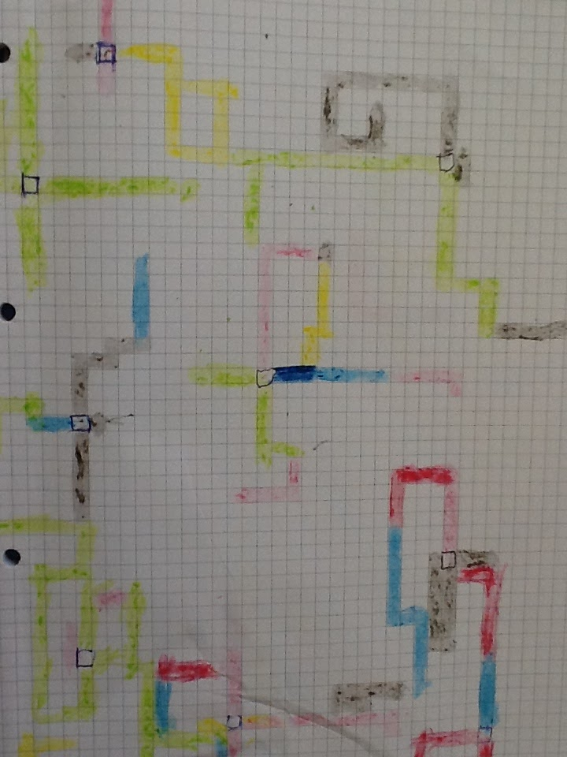

# Computational Thinking

## Thomas Tangles 1

This simplifies the algorithm Thomas' Tangles (named after my son who helped develop it) in Chapter 3 of the book discussed in [http://compuationalthinking.blogspot.co.uk/2016/11/how-to-be-unplugged-artist.html](http://compuationalthinking.blogspot.co.uk/2016/11/how-to-be-unplugged-artist.html)

Using crayons, pencils or pens, we are going to follow an algorithm to create a random drawing. This could be done in pairs and you will need squared paper.

Person A: Rolls the dice and reads out the instructions - their role is to roll the dice, interpret the algorithm and tell the 'robot' what to do.

Person B: Is the 'robot carrying out the instructions'. The lines are solid blocks of colour so move four squares does also mean colour in the squares between the start and finish in the direction of movement.



When a new central square is needed the roles of A and B swap (so A is the 'robot' and B rolls the dice and reads out the instruction). The roles keep swapping.

```ps
Start from a random square – call it the centre square
Repeat until end of game
If die roll = 1
    Roll die for number of moves
    move die roll number of steps up the page
If die roll = 2
    Roll die for number of moves
    move die roll number of steps down the page
If die roll = 3
    Roll die for number of moves
    move die roll number of steps to the left 
If die roll = 4
    Roll die for number of moves
    move die roll number of steps to the right
If die roll = 5
    Roll die
    If die = 1 change colour to Red
    If die = 2 change colour to Blue
        If die = 3 change colour to Black
    If die = 4 change colour to Green
    If die = 5 change colour to Orange
    If die = 6 change colour to Yellow
If die roll = 6
    Roll die
    Return to current centre square
If the second die roll=6
    randomly select new centre square
If block is off the page
    randomly select new centre square
```
The Scratch version can be here [https://scratch.mit.edu/projects/135816631/](https://scratch.mit.edu/projects/135816631/) if you wish to see the code.