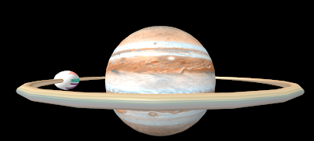
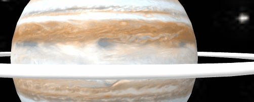

# Web-based VR and AR

## Planet Canterbury Christ Church

## Setting up

Using Mozzila's brilliant AFrame, a web-based Virtual Reality model of a planet with rings and include a moon with an image on it. The first step is to set a new site in trinket (or use the old one) and then add a white sphere on a black background:

```html
<html>
  <head>
    <script src="https://aframe.io/releases/
    0.9.2/aframe.min.js"></script>
  </head>
  <body>
    <a-scene>
      <a-sphere position="0 1.25 -5" radius="3" 
      color="white" >
      </a-sphere>   
      <a-sky color="black"></a-sky>
  </a-scene>
</body>
</html>
```
Using the Aframe `tags` to create a white sphere and to create a black background.

### Rotate the planet and add some colour

Now we can add a surface to the planet by finding an appropriate image to wrap around the sphere. in this example, I used the site Solar Systems Scope [https://www.solarsystemscope.com/textures/](https://www.solarsystemscope.com/textures/) and
downloaded an image of Jupiter's surface [https://www.solarsystemscope.com/textures/download/2k_jupiter.jpg](https://www.solarsystemscope.com/textures/download/2k_jupiter.jpg).

1. If you are using Glitch: This needs to be copied into the assets folder of the project and the URL generated (by left-clicking on the image when it is in the folder) copied.

2. On you own site upload the image to the same folder as the webpage the `URL` will be filename

3. Alternatively use this URL in either approach [https://cdn.glitch.com/febf6408-3c33-4608-ac90-b087753e5792%2F2k_jupiter.jpg?v=1573393224376](https://cdn.glitch.com/febf6408-3c33-4608-ac90-b087753e5792%2F2k_jupiter.jpg?v=1573393224376)

Now by adding `src=""` and in the speech-marks paste in the URL for the image; the image wraps around the sphere:

```html
<html>
  <head>
    <script src="https://aframe.io/releases/0.9.2/
    aframe.min.js"></script>
  </head>
  <body>
    <a-scene>
      <a-sphere position="0 1.25 -5" radius="3" 
      color="white" src="https://cdn.glitch.com/febf6408-3c33-4608-ac90-b087753e5792%2F2k_jupiter.jpg?v=1573393224376">
      </a-sphere>   
      <a-sky color="black"></a-sky>
    </a-scene>
  </body>
</html>
```
Now to rotate it add:

```html 
animation="property: rotation; to: 0 360 0; loop: true; dur: 10000"
``` 
See below:
```html
<a-sphere position="0 1.25 -5"  
   radius="3" color="white"  
   src="https://cdn.glitch.com/febf6408-3c33-4608-ac90-b087753e5792%2F2k_jupiter.jpg?v=1573393224376" 
   animation="property: rotation; to: 0  360 0; loop: true; dur: 10000">
```
### Planets need Rings

In Aframe if you nest another object with the `<>` `<\>` of another object it's position is set relative to the first object. This principle is going to be used here put a ring around the planet. 

The first stage is to add the ring object is used for this and a the same rotating animation is used. We are going to use a squashed doughnut shape `<a-torus\>` to do this. When the webpage is running you will probably need use the down arrow key to zoom out to see the ring.
```html
<html>
  <head>
    <script src="https://aframe.io/releases/0.9.2/aframe.min.js"></script>
  </head>
  <body>
    <a-scene>
      <a-sphere position="0 1.25 -5" radius="3" color="white" src="https://cdn.glitch.com/febf6408-3c33-4608-ac90-b087753e5792%2F2k_jupiter.jpg?v=1573393224376"
                animation="property: rotation; to: 0 360 0; loop: true; dur: 10000">
        <a-torus position="0 0 0" arc="360"
                rotation="90 0 0"
                color="white" radius="5"
                radius-tubular="0.05"
                animation="property: rotation; to:  90 0 0; loop: true; dur: 3000">
          </a-torus>
      </a-sphere>   
      <a-sky color="black"></a-sky>
    </a-scene>
  </body>
</html>
```
>**DON'T PANIC:** It is not expected that you will necessarily understand this all in one go. So experiment now try different values for; `rotation; to: 90 0 0` for example `to: -360 360 0;` and `dur: 3000`, what changed?



### It needs a moon

The process is really just combining elements of the steps 1-3. 

Create a new sphere,set the radius to something around 0.25 to 0.5; colour it with whatever you feel is appropriate, add an image (in the example code one has been added) if you want. Set a rotation it is is fun to play with these a bit and place the moon on the ring (setting `position="5 0 0"` in this case does this).  If the images are accessible as web sources this could be a great option.

Lets put a moon on the ring (ie. within the `<a-torus>` and `<a-torus\>` tags).

So the code for the moon;

```html
<a-sphere position="5 0 0"
  rotation="0 0 0"
  radius="0.5"
  color="yellow" src="https://cdn.glitch.com/febf6408-3c33-4608-ac90-b087753e5792%2Fpanic.png?v=1573395380360"
  animation="property: rotation; to:  0 259 0; loop: true; dur: 3000">
</a-sphere>
```
Gets put inside that of the torus, so the whole thing becomes:

```html
<html>
  <head>
    <script src="https://aframe.io/releases/0.9.2/aframe.min.js"></script>
  </head>
  <body>
    <a-scene>
      <a-sphere position="0 1.25 -5" radius="3" color="white" src="https://cdn.glitch.com/febf6408-3c33-4608-ac90-b087753e5792%2F2k_jupiter.jpg?v=1573393224376"
                animation="property: rotation; to: 0 360 0; loop: true; dur: 10000">
        <a-torus position="0 0 0" arc="360"
                rotation="90 0 0"
                color="white" radius="5"
                radius-tubular="0.05"
                animation="property: rotation; to:  90 90 0; loop: true; dur: 3000">
                <a-sphere position="5 0 0"
                  rotation="0 0 0"
                  radius="0.5"
                  color="yellow" src="https://cdn.glitch.com/febf6408-3c33-4608-ac90-b087753e5792%2Fpanic.png?v=1573395380360"
                  animation="property: rotation; to:  0 259 0; loop: true; dur: 3000">
              </a-sphere>
          </a-torus>
      </a-sphere>   
      <a-sky color="black"></a-sky>
    </a-scene>
  </body>
</html>               
```

### Let's add text and stars

So we might want to put some text into the world we can do that with `<a-text value="">` So adding this to the code (see below) put a message on the screen, though you may have to use the down arrow to see it.
```html
<html>
  <head>
    <script src="https://aframe.io/releases/0.9.2/aframe.min.js"></script>
  </head>
  <body>
    <a-scene>
      <a-sphere position="0 1.25 -5" radius="3" color="white" src="https://cdn.glitch.com/febf6408-3c33-4608-ac90-b087753e5792%2F2k_jupiter.jpg?v=1573393224376"
                animation="property: rotation; to: 0 360 0; loop: true; dur: 10000">
        <a-torus position="0 0 0" arc="360"
                rotation="90 0 0"
                color="white" radius="5"
                radius-tubular="0.05"
                animation="property: rotation; to:  90 90 0; loop: true; dur: 3000">
                <a-sphere position="5 0 0"
                  rotation="0 0 0"
                  radius="0.5"
                  color="yellow" src="https://cdn.glitch.com/febf6408-3c33-4608-ac90-b087753e5792%2Fpanic.png?v=1573395380360"
                  animation="property: rotation; to:  0 259 0; loop: true; dur: 3000">
              </a-sphere>
          </a-torus>
      </a-sphere>   
      <a-text value="Planet CCCU Computing" position="0 4 -2"></a-text>
      <a-sky color="black"></a-sky>
    </a-scene>
  </body>
</html>
```


We can get interesting effects if we add the text between `<a-sphere\>` and `<a-scene\>` Try adding this in there. `<a-text value="Planet CCCU Computing" position="0 3 -2"><a-text\>`

Have a play with altering the text and putting the line elsewhere in the code. What happens?

Now going to use an image to change the background. The image is `"space"` by fleskw is licensed with CC BY 2.0. To view a copy of this license, visit [https://creativecommons.org/licenses/by/2.0](https://creativecommons.org/licenses/by/2.0).

You will need to change the sky colour to a light colour for this to work. So change the sky line in the code to white we are going to use the space image to make it a bit easier it is in this form [https://cdn.glitch.com/425c1a98-7ba9-463d-817d-6b491a516246%2F97b3bf6d-ced1-4041-80d4-b6c9a98ba43d.jfif?v=1614341330757](https://cdn.glitch.com/425c1a98-7ba9-463d-817d-6b491a516246%2F97b3bf6d-ced1-4041-80d4-b6c9a98ba43d.jfif?v=1614341330757)

```html
<a-sky color="white" src="https://cdn.glitch.com/425c1a98-7ba9-463d-817d-6b491a516246%2F97b3bf6d-ced1-4041-80d4-b6c9a98ba43d.jfif?v=1614341330757"></a-sky>
```
Now adding it the code in place of the current `<a-sky\>` line we:

```html
<html>
  <head>
    <script src="https://aframe.io/releases/0.9.2/aframe.min.js"></script>
  </head>
  <body>
    <a-scene>
      <a-sphere position="0 1.25 -5" radius="3" color="white" src="https://cdn.glitch.com/
      febf6408-3c33-4608-ac90-b087753e5792%2F2k_jupiter.jpg?v=1573393224376"
                animation="property: rotation; to: 0 360 0; loop: true; dur: 10000">
        <a-torus position="0 0 0" arc="360"
                rotation="90 0 0"
                color="white" radius="5"
                radius-tubular="0.05"
                animation="property: rotation; to:  90 90 0; loop: true; dur: 3000">
                <a-sphere position="5 0 0"
                  rotation="0 0 0"
                  radius="0.5"
                  color="yellow" src="https://cdn.glitch.com/febf6408-3c33-4608-ac90-b087753e5792%2Fpanic.png?v=1573395380360"
                  animation="property: rotation; to:  0 259 0; loop: true; dur: 3000">
              </a-sphere>
          </a-torus>
      </a-sphere>   
      <a-text value="Planet CCCU Computing" position="0 4 -2"></a-text>
      <a-sky color="white" src="https://cdn.glitch.com/425c1a98-7ba9-463d-817d-6b491a516246%2F97b3bf6d-ced1-4041-80d4-b6c9a98ba43d.jfif?v=1614341330757"></a-sky>
    </a-scene>
  </body>
</html>
```

We are done!



------------------------------
