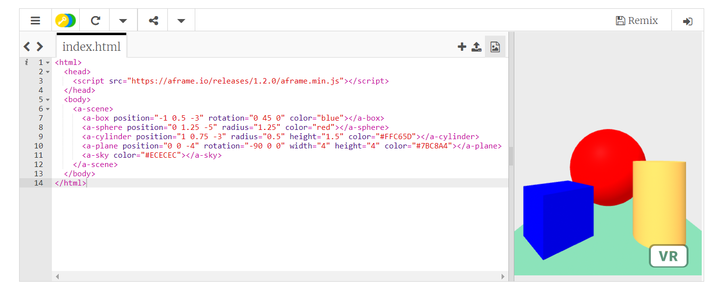
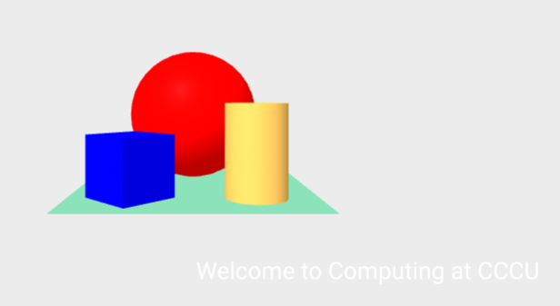

## Web-based VR

### Let's start

Load in the following <https://trinket.io/embed/html/850a678202>

Now replace the code with the following or for a quick fix copy the code
from <https://bit.ly/AframeIntro>:

```html
<html>
  <head>
    <script src="https://aframe.io/releases/1.2.0/aframe.min.js"></script>
  </head>
  <body>
    <a-scene>
      <a-box position="-1 0.5 -3" rotation="0 45 0" color="blue"></a-box>
      <a-sphere position="0 1.25 -5" radius="1.25" color="red"></a-sphere>
      <a-cylinder position="1 0.75 -3" radius="0.5"
      height="1.5" color="#FFC65D"></a-cylinder>
      <a-plane position="0 0 -4" rotation="-90 0 0" 
      width="4" height="4" color="#7BC8A4"></a-plane>
      <a-sky color="#ECECEC"></a-sky>
    </a-scene>
  </body>
</html>
```
You should now see something that looks like:



Click on the the image on screen and play with using the arrow keys and dragging a mouse around. What is the difference between using the arrow keys and the mouse?

Okay now we are going to add some text.

Insert the line:

```html
<a-text value="Welcome to Computing at CCCU"></a-text>
```

Can you see it? You will need to use the arrow keys to see and even it is difficult - white writing on a grey background.



So let us make it a bit easier to see by change the code slight and specify the text colour as black:

```html
<a-text value="Welcome to Computing at CCCU" color="black"></a-text>
```

### Challenge

1. Look through the course material and find a module that interest you and change the message so it welcome people to that module.

1. Experiment with repositioning any of the objects including the text, you may have noticed that some of the objects had a `position=` in their 'coding'; try changing some numbers within one of these, one and at time and work out how they work.

1. There are a number of different objects we can put into the scene some of these are listed within the left-hand menu of `<https://bit.ly/AframeIntro>` under the heading `Primitives`. Try a few out for yourself.

### Try it out
```html
<html>
  <head>
    <script src="https://aframe.io/releases/1.2.0/aframe.min.js"></script>
  </head>
  <body>
    <a-scene>
      <a-box position="-1 0.5 -3" rotation="0 45 0" color="blue"></a-box>
      <a-sphere position="0 1.25 -5" radius="1.25" color="red"></a-sphere>
      <a-cylinder position="1 0.75 -3" radius="0.5"
      height="1.5" color="#FFC65D"></a-cylinder>
      <a-plane position="0 0 -4" rotation="-90 0 0" 
      width="4" height="4" color="#7BC8A4"></a-plane>
      <a-sky color="#ECECEC"></a-sky>
      <a-text position="-2 2 -3" 
      animation="property: rotation; to: 0 360 0; loop: true; dur: 10000" 
      value="Welcome to Computing at CCCU" color="black">
      </a-text>
    </a-scene>
  </body>
</html>
```
------------------------